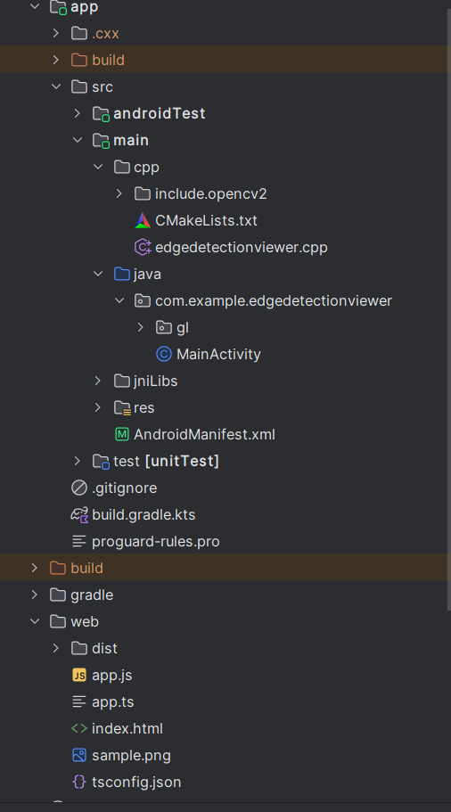
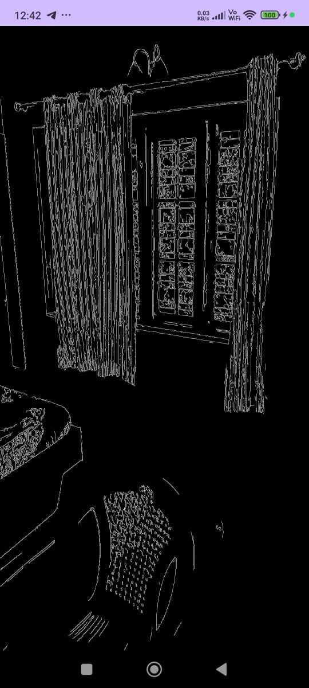

# 📸 Edge Detection Viewer

Edge Detection Viewer is a two-part project built to demonstrate **real-time image processing**, **native C++ OpenCV pipeline**, and a lightweight **web-based PNG viewer**.

This project contains:

1. **Android Application**  
   - Captures live camera frames  
   - Processes them natively using OpenCV (Canny edge detection)  
   - Renders results using OpenGL ES 2.0 textured quad  

2. **Web Application**  
   - Simple PNG viewer built using HTML + TypeScript  
   - Allows selecting and previewing PNG images inside a canvas  

---

## ⭐ Table of Contents

- [Features](#features)
- [Technologies Used](#technologies-used)
- [Project Structure](#project-structure)
- [Android App Setup](#android-app-setup)
- [Web App Setup](#web-app-setup)
- [Screenshots](#screenshots)

---

# ✨ Features

## 📱 Android App
- Real-time camera preview (Camera2 API)
- YUV_420_888 frame extraction
- Correct Y-plane extraction with row + pixel stride support
- Native C++ processing using OpenCV **Canny edge detection**
- Rotation fix for correct device orientation
- OpenGL ES **full-screen textured quad** renderer
- Smooth and efficient real-time visualization

## 🌐 Web App
- PNG upload from user device
- Render image on HTML canvas
- Zero backend required
- Runs on simple static HTTP server

---

# ⚙️ Technologies Used

## Android
- Java
- OpenGL ES 2.0
- Camera2 API
- Native C++
- OpenCV (header-only include)
- JNI + NDK + CMake

## Web
- HTML
- CSS
- TypeScript
- Node.js (http-server)
- Browser Canvas API

---

# 🗂️ Project Structure



---

# 📱 Android App Setup

## ✅ Requirements
- Android Studio (latest)
- Android NDK + CMake installed
- USB debugging enabled
- OpenCV headers placed in `cpp/include.opencv2`

## 🚀 Steps to Run

### 1. Clone the repository

```bash
git clone https://github.com/samarthby/android-opencv-opengl
cd EdgeDetectionViewer
```

### 2. Open project in Android Studio

The IDE will sync Gradle + configure CMake automatically.

### 3. Connect an Android device

Enable:

* Developer options
* USB debugging

### 4. Press **Run ▶**

Android Studio will build the C++ code, install the APK, and launch the application.

---

## 🎯 Expected Output

* Live camera preview
* Edge-detected frame (white edges on black background)
* Correct orientation
* Smooth OpenGL rendering

---

# 🌐 Web App Setup

## Requirements

* Node.js (LTS)
* TypeScript compiler (npx tsc)
* `http-server` (auto installed by `npx http-server`)

## Steps

### 1. Navigate to web folder

```bash
cd EdgeDetectionViewer/web
```
### 2. Compile TypeScript
```bash
npx tsc
```

Output file will appear:

```
web/dist/app.js
```

### 3. Start local server

```bash
npx http-server .
```

### 4. Visit in browser

```
http://127.0.0.1:8081
```

### ℹ️ Note about network IP

```
http://192.168.x.x:8081
```

This works **only if**:

* Your laptop & device are on the same Wi-Fi
* Firewall rules allow connections
* Browser allows fetching local server resources

---

## 🖼️ Screenshots

### Android Output



### Web Output


---

### Android:

* Camera2 frame capture
* Correct Y-plane extraction
* JNI bridge
* OpenCV Canny
* Frame rotation fix
* OpenGL ES textured quad renderer
* Real-time output

### Web:

* Independent PNG viewer
* Clean and minimal implementation
---


